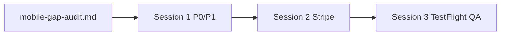

# Mobile follow-up agent sessions

Paste-ready prompts for three scoped agent chats after the [mobile gap audit](mobile-gap-audit.md).  
**Repo:** `/Users/randy/mmhv2` · **Branch:** `main` · **Do not commit unless explicitly asked.**

---

## Session 1 — P0/P1 parity & TestFlight unblockers

```
Meet Me Halfway (mmhv2) — Session 1: P0/P1 mobile parity & TestFlight unblockers

Repo: /Users/randy/mmhv2, branch `main` (Next.js 15 web + Expo mobile).
Goal: Unblock TestFlight and close P0/P1 gaps from docs/mobile-gap-audit.md — WITHOUT Stripe UI work and WITHOUT @sentry/react-native.

## Hard rules
- Do NOT consolidate geo providers or refactor the web geo stack beyond what’s needed for new `/api/mobile/*` routes.
- Do NOT start Tailwind v4, Next upgrades, or unrelated web features.
- Do NOT commit unless I explicitly ask.
- Mobile stays Expo managed (no committed `ios/` unless you recommend a deliberate one-off prebuild for verification).
- Canonical docs: docs/mobile-ios-runbook.md, docs/mobile-qa-checklist.md, docs/mobile-ios-release-checklist.md, docs/app-structure.md, docs/mobile-gap-audit.md.

## Context (already on main)
- Gap audit: docs/mobile-gap-audit.md
- Authenticated mobile APIs work: /api/mobile/profile, /api/mobile/saved/*
- Public proxies mobile still calls: /api/mobile/route, /api/ors/geocode, /api/ors/matrix, /api/pois/search — unauthenticated, tier-blind
- MeetMeHalfwayMobile/.env is TRACKED in git — must gitignore and stop tracking (do not paste secrets in chat)
- EAS projectId placeholder: CHANGE_ME_IN_EAS in MeetMeHalfwayMobile/app.config.ts
- app.config.ts vs app.json drift (Stripe plugin only in app.json today)

## Tasks (in priority order)

### A. Release / config (P0)
1. Add MeetMeHalfwayMobile/.env to .gitignore; remove from git index (`git rm --cached`) if tracked — tell me to rotate keys.
2. Consolidate Expo config into MeetMeHalfwayMobile/app.config.ts:
   - Stripe plugin: ["@stripe/stripe-react-native", { merchantIdentifier: "merchant.com.meetmehalfway.mobile", enableGooglePay: false }]
   - newArchEnabled: true
   - extra.stripePublishableKey from env
   - Keep bundleIdentifier com.meetmehalfway.mobile
3. Create MeetMeHalfwayMobile/eas.json with development, preview, production profiles (iOS).
4. Document in a short comment or docs snippet: run `eas init` to replace CHANGE_ME_IN_EAS (I will run interactively if needed).

### B. Authenticated mobile API routes (P1)
5. Require Clerk Bearer auth on POST /api/mobile/route (401 if missing) — mobile client must send token from useSafeAuth.
6. Add POST /api/mobile/geocode — auth required; delegate to existing geocode server action used by web (actions/geocoding-test.ts or locationiq-actions — pick one, document choice).
7. Add POST /api/mobile/matrix — auth required; if user tier is pro or business, use getTrafficMatrixHereAction (requireProPlan); else getTravelTimeMatrixAction (ORS).
8. Update MeetMeHalfwayMobile/src/services/api.ts (and poi.ts if needed) to call new /api/mobile/* paths with Authorization: Bearer.
9. Fix middleware getRateLimitType if any public ORS paths remain — ensure /api/mobile/route and /api/ors/geocode match intended buckets.

### C. Tier parity (P1)
10. Align 3+-origin rule: enforce Pro (or business) for >2 origins on mobile (MeetMeHalfwayMobile/app/(tabs)/index.tsx) to match web results-map.tsx. Use shared/tier-limits.ts; show upgrade alert consistent with web messaging.
11. Optionally align web if product wants Plus to have 3-origin centroid — only if I confirm; default is Pro-required everywhere.

### D. Saved data bug (P1)
12. When signed in, stop writing to AsyncStorage in search flow (index.tsx) — cloud only via cloudSync.
13. useSavedData: keep cloud-as-source-of-truth when signed in; ensure delete/create still work.

### E. Cleanup (P2, quick)
14. Remove dead code: searchPOIs in api.ts, unused AccountButton in _layout.tsx, unused setFilter in two.tsx; remove EXPO_PUBLIC_MOBILE_PLAN_TIER from .env.example if unused.
15. Replace or remove starter modal.tsx (About/Help with version) — your judgment.

### F. Docs (P1)
16. Update docs/mobile-qa-checklist.md: native Clerk auth (not “Sign In on Web”); plan from /api/mobile/profile.
17. Update docs/mobile-ios-runbook.md: list /api/mobile/geocode and /api/mobile/matrix; note auth required.
18. Update docs/mobile-ios-release-checklist.md: Stripe plugin lives in app.config.ts.

## Verification
- npm run mobile:check-env
- npm run dev (web on :3000)
- npm run mobile:dev or npm run --prefix ./MeetMeHalfwayMobile ios
- Signed-in: profile tier matches user; 2-origin route works; 3-origin blocked for starter/plus if Pro rule applied; saved tab shows cloud data only
- Unsigned: geocode/route/matrix return 401 from new mobile endpoints (or document guest behavior if we allow anon with stricter limits)

## Deliverables
- Summary of files changed
- List anything I must do manually (eas init, ASC bundle ID registration, key rotation)
- Do NOT implement Stripe PaymentSheet in this session
```

---

## Session 2 — Stripe mobile (in-app PaymentSheet + billing portal)

```
Meet Me Halfway (mmhv2) — Session 2: Stripe in-app checkout on mobile

Repo: /Users/randy/mmhv2, branch `main`.
Prerequisite: Session 1 complete (app.config.ts has Stripe plugin, EAS scaffold, /api/mobile/* auth routes).
Goal: Wire @stripe/stripe-react-native PaymentSheet end-to-end so upgrades work in-app (not external pricing URL only).

## Hard rules
- Do NOT consolidate geo providers or refactor unrelated web code.
- Do NOT commit unless I explicitly ask.
- Reuse existing Stripe webhook at app/api/stripe/webhooks/route.ts and actions/stripe/* — webhook should not need changes if checkout creates subscriptions correctly.
- Mobile Expo managed; Stripe plugin must be in app.config.ts.

## Reference
- Web checkout: actions/stripe/createCheckoutSession.ts
- Web upgrade UI: components/upgrade-modal.tsx
- Mobile upgrade today: Linking.openURL("https://meetmehalfway.co/pricing") in MeetMeHalfwayMobile/app/(tabs)/index.tsx
- Gap audit: docs/mobile-gap-audit.md (rows 11–12)
- Env: EXPO_PUBLIC_STRIPE_PUBLISHABLE_KEY in MeetMeHalfwayMobile/.env (EAS secrets for production)

## Tasks

### A. Server — mobile Stripe API routes
1. POST /api/mobile/stripe/checkout-session
   - Clerk Bearer auth required
   - Body: { priceId: string } (monthly tier price IDs — mirror web env vars NEXT_PUBLIC_STRIPE_PRICE_*_MONTHLY)
   - Create or reuse Stripe customer (same logic as createCheckoutSession)
   - Return PaymentSheet-ready payload, e.g.:
     { paymentIntentClientSecret, ephemeralKeySecret, customerId, publishableKey }
   - Use Stripe API patterns recommended for @stripe/stripe-react-native (PaymentIntent + Customer + Ephemeral Key for subscriptions — follow Stripe docs for subscription PaymentSheet on mobile).

2. POST /api/mobile/stripe/billing-portal
   - Clerk Bearer auth required
   - Return { url } from createBillingPortalSessionAction (or equivalent)
   - returnUrl should use app scheme mmh:// or https://meetmehalfway.co/pricing

### B. Mobile client
3. Wrap app with StripeProvider in MeetMeHalfwayMobile/app/_layout.tsx (publishableKey from EXPO_PUBLIC_STRIPE_PUBLISHABLE_KEY).
4. Create UpgradeModal or upgrade flow component:
   - Tier selection (Plus / Pro / Business) using same price IDs as web
   - Call checkout-session API with Bearer token
   - presentPaymentSheet(); handle success/cancel/error
5. After success: poll GET /api/mobile/profile until tier updates (or refetch usePlan), with timeout + user message
6. Replace Linking.openURL pricing CTA on map tab with in-app upgrade modal
7. Add “Manage subscription” entry (account menu or Saved tab) → billing-portal API → WebBrowser.openAuthSessionAsync(url, mmh:// return)

### C. Edge cases
8. User already subscribed to selected price → return billing portal URL (mirror web createCheckoutSession behavior)
9. Signed-out user taps upgrade → navigate to sign-in first

## Verification
- npm run dev + mobile:dev with Stripe TEST keys
- Test card 4242... completes PaymentSheet
- Webhook updates profiles.membership; /api/mobile/profile reflects new tier
- usePlan maxLocations updates after purchase

## Deliverables
- Files touched list
- Env vars I must set in EAS for production Stripe keys
- Note any Apple IAP / App Store guideline considerations for digital subscriptions (document, don’t block unless critical)
- Do NOT add Sentry/PostHog in this session
```

---

## Session 3 — TestFlight build & QA sign-off

```
Meet Me Halfway (mmhv2) — Session 3: TestFlight build + QA sign-off

Repo: /Users/randy/mmhv2, branch `main`.
Prerequisites: Session 1 (API parity, config, docs) and Session 2 (Stripe PaymentSheet) complete.
Goal: Run full mobile QA, produce TestFlight build, document pass/fail, fix P0 regressions only.

## Hard rules
- Do NOT consolidate geo providers or unrelated web refactors.
- Do NOT commit unless I explicitly ask.
- Expo managed workflow unless build failure forces prebuild discussion.

## Canonical checklists
- docs/mobile-qa-checklist.md (update if Session 1 changed flows)
- docs/mobile-ios-release-checklist.md
- docs/mobile-ios-runbook.md
- docs/mobile-gap-audit.md TestFlight section

## Phase B — Local smoke (Simulator)

Prerequisites:
```bash
npm run mobile:check-env
npm run dev          # terminal 1 — web API on :3000
npm run mobile:dev   # or: npm run --prefix ./MeetMeHalfwayMobile ios
```

Execute docs/mobile-qa-checklist.md systematically. Record pass/fail per item in a new section at bottom of docs/mobile-qa-checklist.md OR a separate docs/mobile-qa-results-YYYY-MM-DD.md (ask me which I prefer if unclear).

For each failure capture: screen, API status, log line, file to fix.

Required verification:
- usePlan tier from /api/mobile/profile matches signed-in user (not env override)
- 2-location and 3+ location flows per tier rules from Session 1
- Saved tab cloud sync when signed in
- POI external links (Apple/Google/Waze)
- Upgrade PaymentSheet (Session 2) on Simulator
- 429 / error UX if encountered

EXPO_PUBLIC_API_BASE_URL must reach Mac (localhost:3000 or LAN IP for device).

## TestFlight

1. Confirm eas.json production profile and app.config.ts projectId are real (not CHANGE_ME_IN_EAS).
2. Confirm com.meetmehalfway.mobile registered in App Store Connect (note if I must do manually).
3. Run: eas build --profile production --platform ios (or preview for internal)
4. Document build URL and any credential prompts I must complete
5. Internal TestFlight distribution steps
6. eas submit --platform ios when build is green (or document submit command for me)

## Deliverables
- QA results table (pass/fail per checklist item)
- List of P0 bugs found and fixed vs deferred
- TestFlight build link / build ID
- Short “ship readiness” verdict: ready / not ready + remaining blockers
- Do NOT reopen Session 1/2 scope unless blocking TestFlight

## Out of scope
- PostHog / Sentry mobile integration
- Geo provider consolidation
```

---

## Session order



| Session | Focus | Blocks TestFlight? |
|---------|--------|-------------------|
| 1 | EAS config, auth APIs, tier parity, saved bug, docs | Yes (P0 items) |
| 2 | Stripe PaymentSheet | Yes (upgrade path) |
| 3 | QA + EAS build + submit | Final gate |
