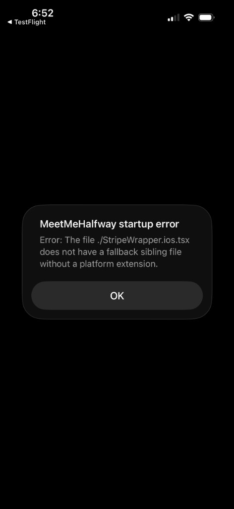
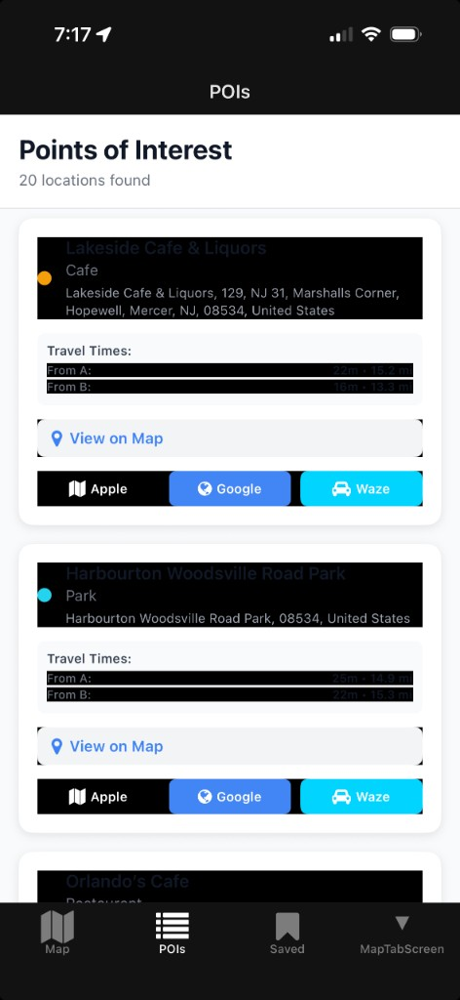
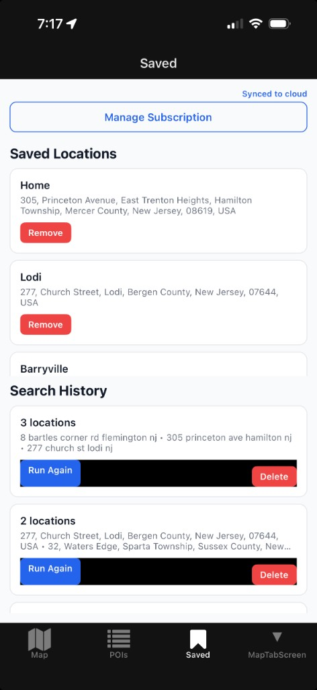
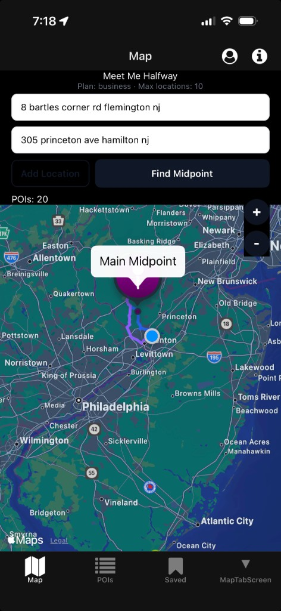

# Mobile QA Results — 2026-06-13 (Build 28 → 29, On-Device TestFlight)

**App:** MeetMeHalfway `com.meetmehalfway.mobile` · **Version:** 1.0.0
**Device:** physical iPhone (iOS 26) · **Distribution:** TestFlight
**Checklist:** [mobile-qa-checklist.md](mobile-qa-checklist.md)
**Prior results:** [mobile-qa-results-2026-05-24.md](mobile-qa-results-2026-05-24.md) (Session 3, Simulator)

---

## Build 29 — polish + cleanup (pending on-device QA)

**Build:** 1.0.0 (29) · [EAS build](https://expo.dev/accounts/duhitsrandy/projects/meet-me-halfway/builds/114c9f0f-f59a-4f52-a377-187baf7106eb) · [TestFlight](https://appstoreconnect.apple.com/apps/6772851211/testflight/ios)

**Changes shipped:**
- Locked app to **light mode** (`userInterfaceStyle: 'light'` + forced `useColorScheme`) — fixes ISSUE-1 dark-on-dark contrast.
- Hid stray **MapTabScreen** 4th tab (`href: null` in tabs layout).
- Removed debug scaffolding: boot HUD, `debugBootLog`, `iosBootPhase`, startup Alert.

**On-device QA (TODO — run on build 29):**
- [ ] POIs/Saved cards readable; tab bar shows exactly **3 tabs** (Map, POIs, Saved).
- [ ] Apple/Google/Waze nav links open.
- [ ] Session persists after reload; sign-out returns to guest.
- [ ] Run Again repopulates inputs; Delete refreshes lists.
- [ ] 2-location route polyline draws; recheck 3-location POIs (ISSUE-2 watch).
- [ ] iOS upgrade path shows text-only notice (no PaymentSheet); Manage Subscription opens portal.

---

## Build 28 — first working on-device release

Builds 8–24 failed at launch (instant crash, then splash hang). Build 28 is the
**first build to reach the app UI on a physical device** and complete a real
search end-to-end (two locations → midpoint → POIs → external nav links).

| Build | Result | Root cause / change |
|-------|--------|---------------------|
| 8–18 | Instant crash (`SIGABRT`, unhandled JS fatal) | New Arch / Stripe / auth import order (progressively fixed) |
| 20–21 | Crash persisted | Fatal handler still forwarded to `RCTFatal` → `abort()` |
| 22 | Crash → **splash hang** | Fatals swallowed; UI never painted |
| 26 (minimal) | Plain RN screen rendered | Proved Hermes/RN/native launch are healthy on device |
| 27 | Native **Alert** surfaced the real error | Splash lock removed; pre-layout fatals made visible |
| **28** | **App works** | Moved `StripeWrapper.*`/`ClerkAppShell` out of `app/` (expo-router was treating `StripeWrapper.ios.tsx` as a route with no base sibling) |

**Build 27 error that pinpointed the fix:**



---

## Current state (rough look — to polish before App Store)

### POIs tab



### Saved tab



### Map tab



---

## Known issues

### ISSUE-1 — Dark-mode contrast: invisible text / black bars (P1, root cause confirmed)

**Symptom:** On the POIs and Saved tabs, POI names and the "From A / From B"
travel-time values render as dark text on a dark background (black bars), and
some rows are unreadable in dark mode.

**Root cause:** Screens use `Text`/`View` from `@/components/Themed`, which inject
a theme-based color/background as the first style entry:

```tsx
// MeetMeHalfwayMobile/components/Themed.tsx
return <DefaultView style={[{ backgroundColor }, style]} ... />;
```

Nested views in `app/(tabs)/two.tsx` (e.g. `poiHeader`, `poiInfo`,
`travelInfoRow`, `actionButtons`) have **no explicit `backgroundColor`**, so they
inherit the **dark** themed background, while text colors are hardcoded dark
(`#111827`, `#6b7280`). Dark-on-dark = invisible.

**Fix options:** use plain `react-native` `View`/`Text` for these cards with an
explicit light palette; or set explicit backgrounds on nested views; or lock the
app to a light theme. Likely affects POIs + Saved similarly.

### ISSUE-2 — 3-location search showed no POIs on first run (P2, transient — watch)

**Symptom:** First 3-location search showed a midpoint but **no POIs**; a retry
showed both midpoint and POIs.

**Analysis:** Not the tier gate — `requiresProForOriginCount(3, "business")` is
`false`, so Business is allowed. The 3+ path uses a **centroid** (no route line),
which is expected. The empty-POI first run was likely transient (POI/matrix
timing or radius). **Action:** keep an eye on it; reproduce if it recurs and
capture which step returned empty.

### ISSUE-3 — Debug instrumentation still in the build (P1, cleanup before App Store)

Boot HUD (`MMH BOOT …`), `debugBootLog`, `iosBootPhase`, and the startup `Alert`
are diagnostic scaffolding. Remove before the public App Store submission (keep
until on-device QA is fully signed off).

---

## Results by checklist section (Build 28, on-device)

### Startup / launch

| Item | Result | Notes |
|------|--------|-------|
| Cold launch reaches app UI | **PASS** | First time on a physical device |
| No crash / no splash hang | **PASS** | Splash clears to app |
| Fatal errors surface (not silent) | **PASS** | Build 27 alert proved the pipeline |

### Auth

| Item | Result | Notes |
|------|--------|-------|
| Sign in | **PASS** | User signed in on device |
| Session persists after reload | **TODO** | Reopen app, confirm still signed in |
| Sign out → guest | **TODO** | From account menu / Saved tab |
| `EXPO_PUBLIC_REQUIRE_AUTH` redirect | **TODO** | Confirm gate behavior |

### Plan / tier

| Item | Result | Notes |
|------|--------|-------|
| Plan label matches profile | **PASS** | Map header shows "Plan: business · Max locations: 10" |
| Business 3+-origin allowed | **PASS** | Gate correctly permits; see ISSUE-2 for POI flakiness |
| Starter/Plus 3-origin blocked | **TODO** | Needs a Starter/Plus account on device |

### Map + search flow

| Item | Result | Notes |
|------|--------|-------|
| 2-location: midpoint renders | **PASS** | Confirmed on device |
| 2-location: POIs render | **PASS** | 20 POIs found |
| 3+ locations centroid + POIs | **PARTIAL** | Worked on retry; see ISSUE-2 |
| Route polyline (2-loc) | **TODO** | Confirm main/alternate route lines draw |
| Rapid Find Midpoint debounce | **TODO** | `if (loading) return` guard exists |

### POI + external navigation

| Item | Result | Notes |
|------|--------|-------|
| POI list displays | **PASS** | POIs tab populated |
| Apple Maps link | **TODO** | Tap and confirm it opens |
| Google Maps link | **TODO** | Tap and confirm it opens |
| Waze link | **TODO** | Tap and confirm it opens |
| Readable POI cards | **FAIL** | ISSUE-1 dark-mode contrast |

### Saved data + sync

| Item | Result | Notes |
|------|--------|-------|
| Saved locations show | **PASS** | Home / Lodi / Barryville visible |
| Search history shows | **PASS** | Multiple entries present |
| "Synced to cloud" (signed in) | **PASS** | Banner shown |
| Run Again restores inputs | **TODO** | Tap and confirm map fields repopulate |
| Delete refreshes list | **TODO** | Remove an item and confirm |
| Readable Saved cards | **FAIL** | ISSUE-1 contrast on history rows |

### iOS billing policy (App Store 3.1.1)

| Item | Result | Notes |
|------|--------|-------|
| No PaymentSheet / no "View Plans" on iOS | **TODO** | Trigger an upgrade path and confirm text-only notice |
| Manage Subscription opens portal | **TODO** | "Manage Subscription" button visible on Saved tab |

---

## Next steps

1. ~~**Polish:** fix ISSUE-1 (dark-mode contrast)~~ — **build 29:** `userInterfaceStyle: 'light'` + forced `useColorScheme`.
2. ~~**Tab bar:** stray "MapTabScreen" tab~~ — **build 29:** hidden via `href: null` in tabs layout.
3. ~~**Cleanup:** remove debug HUD / logging / startup alert (ISSUE-3)~~ — **build 29:** removed `debugBootLog`, `iosBootPhase`, boot HUD.
4. **Finish on-device QA:** complete the **TODO** rows above on **build 29** (TestFlight).
5. **Watch ISSUE-2:** reproduce 3-location empty-POI case if it recurs.

## Ship readiness verdict

| Gate | Status |
|------|--------|
| Launches on device | **Yes** (build 28+) |
| Core search flow works | **Yes** (2-location verified end-to-end) |
| UI polish | **Pending build 29 QA** — light mode lock + 3-tab bar |
| App Store submission | **After build 29 QA** — debug scaffolding removed in code |
